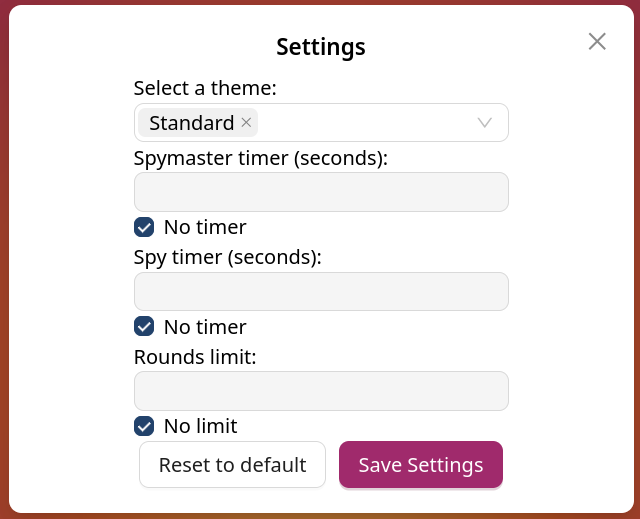
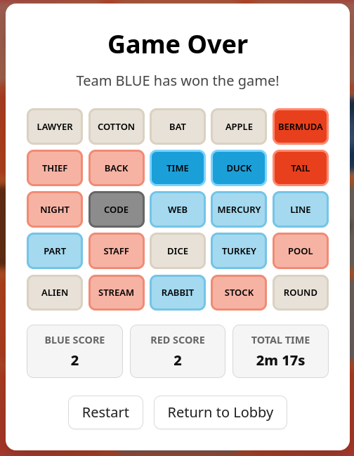

# SopraFS26 - Codenames Online

## Introduction

This project is a real-time multiplayer implementation of the board game *Codenames*.
The goal is to allow groups to play together without having to carry the physical version with them: two players act as the *Spymasters* who give one-word clues, while the others act as *Spies* who guess the corresponding word cards on the board.
The backend handles lobby management, game state (board generation, turn order, scoring), WebSocket broadcasting, and persistence of histories.

**Motivation** - To provide a fully online Codenames experience with a reactive UI, time limits and configurable settings. This is a semester project for the *Software Engineering Lab* at UZH.

---

## Technologies Used

- **[TypeScript](https://www.typescriptlang.org/)** - Core Language
- **[React](https://react.dev/)** - Component-based UI library
- **[Next.js](https://nextjs.org/)** - React framework for the frontend application
- **[Vercel](https://vercel.com/)** - Deployment platform for hosting the frontend application
- **[Antd](https://ant.design/)** - UI component library
- **[CSS Modules](https://github.com/css-modules/css-modules)** - Scoped component styling
- **[Spring WebSocket](https://spring.io/guides/gs/messaging-stomp-websocket/) with Stomp** - Real-time communication
- **[Node.js](https://nodejs.org/)** - JavaScript runtime environment
- **[npm](https://npmjs.com/)** - Package manager and dependency manager
- **[Docker](https://www.docker.com/)** - Container platform for building, shipping and running isolated, reproducible environments

---

## High-Level Components

| Components | Role | Main class / file |
| ---------- | ---- | ----------------- |
| **Lobby Page** | Create, join, leave lobbies; transfer host; assign teams/roles; configure settings (time limits, rounds, difficulty). | [`Create/ Join lobby`](app/page.tsx) / [`Manage lobby`](app/[lobbyCode]/page.tsx) |
| **Game Page** | Display and interact with the board; play the game; chat with other players; routing players after the game ended. | [`Game Page`](app/[lobbyCode]/game/page.tsx) |
| **WebSocket Messaging** | Broadcast live lobby updates (leaving, role changes); Broadcast live game updates (board, clue, guess, turn change, timer) to different roles (spymaster vs spy). | [`lobbyWebsocket`](app/utils/lobbyWebsocket.ts) / [`useLobbyWebSocket`](app/hooks/useLobbyWebSocket.ts) /  [`gameWebsocket`](app/utils/gameWebsocket.ts) / [`useGameWebSocket`](app/hooks/useGameWebSocket.ts)|
| **API and types** | Handles backend requests and shared data structures. | [`useApi`](app/hooks/useApi.ts) / [`types`](app/types) |

---

## Launch & Deployment

### Prerequisites

- **Node.js**
- **npm**
- **Git** (To clone the repository)

### Local Development

1. **Clone the repository**  
    ```bash
    git clone https://github.com/SolarisCulture/sopra-fs26-group-25-client.git
    cd sopra-fs26-group-25-client
    ```
2. **Install dependencies**
    ```bash
    npm install
    ```
3. **Build the application**
    ```bash
    run build
    ```
4. **Start the application**
    ```bash
    npm run dev
    ```

To access the web pages you can do so by the IP adress provided in the console, or locally at `http://localhost:3000`.

If you want to see the application in action, you will also need the [backend](https://github.com/SolarisCulture/sopra-fs26-group-25-server).

New releases are automatically built and deployed when changes are pushed to the `main` branch. You can additionally manually trigger a deployment by re-running the workflow in the *Actions* tab.

## User flow

The user would first create or join an existing lobby.
After joining a lobby, the user chooses a username and either assign themselves, or get assigned by the host.
In the lobby the host can configure the game: Themed words, Time limit and Round limit.





Once all users are assigned the host can start the game by clicking the now enabled "Start Game" button.


From there users can play the game. For the flow of the game and the rules, checkout [the rules.](./public/images/codenames-rules-en.pdf)


After the game has concluded, the host can decide to start the game, keeping the rules, or go back to the lobby.



## Roadmap
-- ???

## Authors
| Name          | Personal page                                                                                                                                  |
|-------------------|----------------------------------------------------------------------------------------------------------------------------------------------- |
| Aldin Haric  | https://github.com/Kirusou |
| Philipp Schneeberger | https://github.com/PhlipperCH |
| Phuoc Tuong Timmy Ho | https://github.com/Timmy-Ho |
| Polina Karanxha | https://github.com/SolarisCulture |
| Sereina Liana Decurtins | https://github.com/serilia03 |

## Acknowledgement
- This repository code derives the framework from the kind **UZH HASEL team** provided [SoPra FS26 - Client Template](https://github.com/HASEL-UZH/sopra-fs26-template-client).
- Many thanks to **Luke Benjamin Fohringer** who helped us as our TA during this project.

## License
We publish the code under the terms of the [Apache 2.0 License](https://github.com/T0hsakaR1n126/sopra-fs25-group-10-client/blob/main/LICENSE) that allows distribution, modification, and commercial use. This software, however, comes without any warranty or liability.
